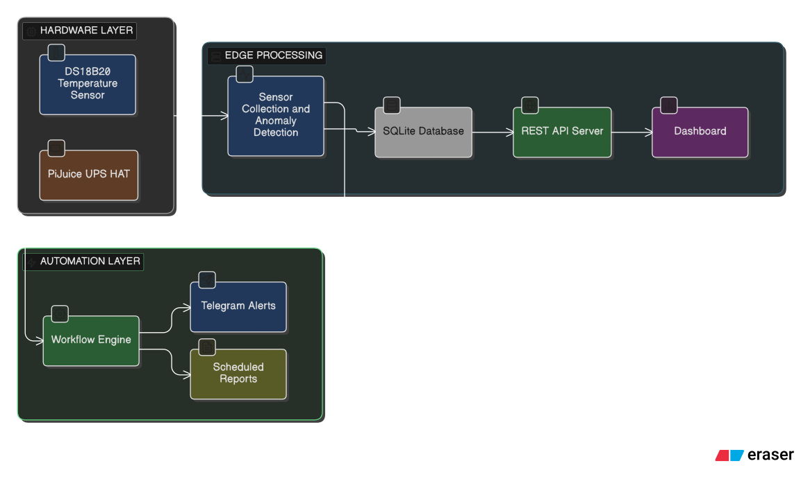

# Sentra

Raspberry Pi-based cold chain and power monitoring system. Tracks fridge temperature and
power stability at the edge, stores data locally, serves a live dashboard,
and triggers automated alerts via n8n.

Built for unreliable power and low-connectivity environments.

## Architecture



## Stack

- **Hardware**: Raspberry Pi 4B, DS18B20, PiJuice UPS HAT
- **Data**: Python 3, SQLite
- **API**: Flask, Flask-CORS
- **Dashboard**: HTML, Chart.js, Lucide Icons
- **Automation**: n8n (via Docker), Telegram API
- **Future**: RS485/Modbus (Waveshare adapter), Cloudflare Tunnel

## Structure

```
sentra/
├── scripts/
│   ├── monitor.py          # Sensor collection + anomaly detection
│   └── api_server.py       # REST API
├── dashboard/
│   └── index.html          # Monitoring dashboard
├── docker/
│   ├── docker-compose.yml  # n8n container config
│   └── n8n_workflow.json   # Alert workflow
├── docs/
│   └── WIRING.md           # Hardware connection guide
├── data/                   # SQLite DB (runtime, gitignored)
├── logs/                   # App logs (runtime, gitignored)
└── netlify.toml            # Deploy config
```

## Setup

```bash
# Clone and create venv
git clone https://github.com/monfortbrian/sentra-cold-chain-monitoring.git
cd sentra && python3 -m venv venv && source venv/bin/activate
pip install flask flask-cors requests schedule

# Enable 1-Wire
sudo raspi-config  # Interface Options → 1-Wire → Enable
sudo reboot

# Install services
sudo cp docs/sentra-*.service /etc/systemd/system/
sudo systemctl daemon-reload
sudo systemctl enable --now sentra-monitor sentra-api

# Start n8n
cd docker && docker compose up -d
```

Dashboard: `http://<PI_IP>:5000`
n8n: `http://<PI_IP>:5678`

## API

| Method | Endpoint                          | Returns                                      |
| ------ | --------------------------------- | -------------------------------------------- |
| GET    | `/api/health`                     | `{ status, readings }`                       |
| GET    | `/api/status`                     | Current temp, battery, power, incident count |
| GET    | `/api/temperature?hours=24`       | Temp readings + min/max/avg stats            |
| GET    | `/api/battery?hours=24`           | Battery % history                            |
| GET    | `/api/incidents?limit=50`         | Incident log                                 |
| GET    | `/api/summary?days=7`             | Compliance report data                       |
| POST   | `/api/incidents/<id>/acknowledge` | Mark incident acknowledged                   |

## Hardware

See [docs/WIRING.md](docs/WIRING.md) for DS18B20 and PiJuice connection guide.

## License

MIT

## Contact

monfortnkurunziza0@gmail.com
